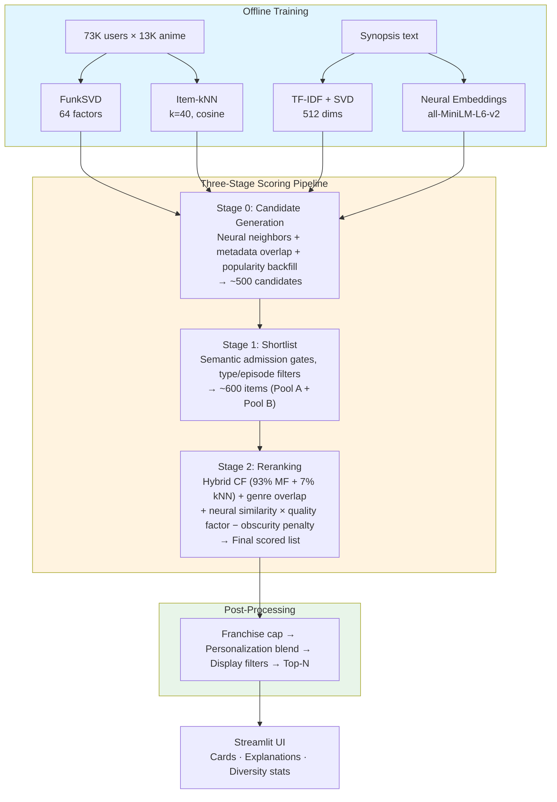

# MARS — My Anime Recommendation System


[](https://codecov.io/gh/daedwards06/MyAnimeRecommendationSystem)

A **hybrid recommendation engine** that combines collaborative filtering, content-based similarity, and neural embeddings to recommend anime from a catalog of 13,000+ titles. Built with a three-stage scoring pipeline (candidate generation → shortlist → reranking), a Streamlit UI with explainable results, and 210 automated tests.

<!-- To update: run the app (streamlit run app/main.py), search for a popular title, take a screenshot, save to app/assets/demo_screenshot.png -->

*Seed-based recommendations for Steins;Gate showing match scores, signal explanations, and metadata cards.*

---

## Key Features

- **Three-stage ranking pipeline** — candidate generation (neural + metadata + popularity pools), semantic shortlisting, hybrid reranking with 10+ scoring signals
- **Hybrid collaborative filtering** — FunkSVD matrix factorization (93%) + item-kNN (7%), trained on 73K users and 310K+ ratings
- **Multi-modal content signals** — TF-IDF, SVD embeddings, and neural sentence embeddings (all-MiniLM-L6-v2) for synopsis-level semantic matching
- **Personalization** — import your MyAnimeList profile; blend seed-based and CF-based recommendations 0–100% with a slider
- **Explainability** — every recommendation shows signal breakdown (CF / Content / Popularity shares), genre overlap, and match confidence
- **Diversity controls** — franchise capping, configurable quality factor modes, coverage and Gini tracking

## Results

### Evaluation Metrics

Evaluated on a temporal split (300 users, full 13K-item candidate space — no pre-filtered shortlist):

| Metric | @5 | @10 | @20 |
|--------|-----|------|------|
| **NDCG** | 0.440 | 0.438 | 0.445 |
| **MAP** | 0.153 | 0.090 | 0.074 |

> **Note:** These metrics reflect ranking over the *entire catalog* (13K items), not a small pre-selected candidate set. Full-catalog NDCG values in the 0.4 range are competitive for open-domain recommendation. Ablation studies show +43% NDCG lift and +61% MAP lift over a popularity-only baseline.

| Beyond Accuracy | @10 |
|-----------------|-----|
| **Gini Index** | 0.50 |
| **Coverage** | 0.18% |

### Ablation Highlights

| Variant | NDCG@10 | vs. Popularity Baseline |
|---------|---------|------------------------|
| Hybrid (MF + kNN + content) | **0.438** | **+43% lift** |
| Content-only (TF-IDF) | 0.025 | — |
| Popularity baseline | 0.031 | (baseline) |

See [`reports/phase4_evaluation.md`](reports/phase4_evaluation.md) for full metric curves, cold-start analysis, and ablation details.

## Architecture



## Quick Start

```bash
git clone https://github.com/daedwards06/MyAnimeRecommendationSystem.git
cd MyAnimeRecommendationSystem
python -m venv .venv && .venv\Scripts\activate  # Windows
pip install -r requirements.txt
streamlit run app/main.py
```

The app loads with a default seed and shows recommendations immediately — no setup needed.

**Optional — Personalization:** Import your [MyAnimeList export](https://myanimelist.net/panel.php?go=export) via the sidebar to get CF-based recommendations from your own ratings. See [`docs/user_guide_personalization.md`](docs/user_guide_personalization.md) for the full walkthrough.

## Project Structure

```
├── app/main.py                  # Streamlit UI (1,900 lines)
├── src/
│   ├── app/
│   │   ├── scoring_pipeline.py  # Pure-Python 3-stage pipeline (1,800 lines)
│   │   ├── artifacts_loader.py  # Model loading + validation
│   │   ├── constants.py         # All scoring weights & thresholds
│   │   ├── recommender.py       # Hybrid CF blending
│   │   ├── stage0_candidates.py # Candidate generation
│   │   ├── stage1_shortlist.py  # Shortlist construction
│   │   └── components/          # Card rendering, explanations, diversity panel
│   ├── models/                  # FunkSVD, kNN, content similarity, user embeddings
│   ├── eval/                    # Metrics (NDCG, MAP, coverage, Gini, graded relevance)
│   ├── features/                # Feature engineering, embeddings, scaling
│   └── data/                    # Data loading, MAL parser, user profiles
├── tests/                       # 210 tests across 22 files
├── reports/                     # Evaluation reports, ablation studies
├── models/                      # Trained model artifacts (.joblib, .gitignored)
└── data/                        # Raw, interim, processed data (.gitignored)
```

## Tech Stack

**ML/Data:** NumPy, pandas, scikit-learn, Optuna | **Embeddings:** sentence-transformers (all-MiniLM-L6-v2) | **App:** Streamlit | **Search:** RapidFuzz | **CI:** GitHub Actions, pytest

## Documentation

| Topic | Link |
|-------|------|
| Evaluation & ablation | [`reports/phase4_evaluation.md`](reports/phase4_evaluation.md) |
| Personalization guide | [`docs/user_guide_personalization.md`](docs/user_guide_personalization.md) |
| Watchlist import | [`docs/user_guide_watchlist.md`](docs/user_guide_watchlist.md) |
| Data catalog | [`docs/data_catalog.md`](docs/data_catalog.md) |
| Scoring pipeline design | [`docs/scoring_pipeline_integration_guide.md`](docs/scoring_pipeline_integration_guide.md) |
| Improvement roadmap | [`docs/MARS_IMPROVEMENT_PLAN.md`](docs/MARS_IMPROVEMENT_PLAN.md) |

```
