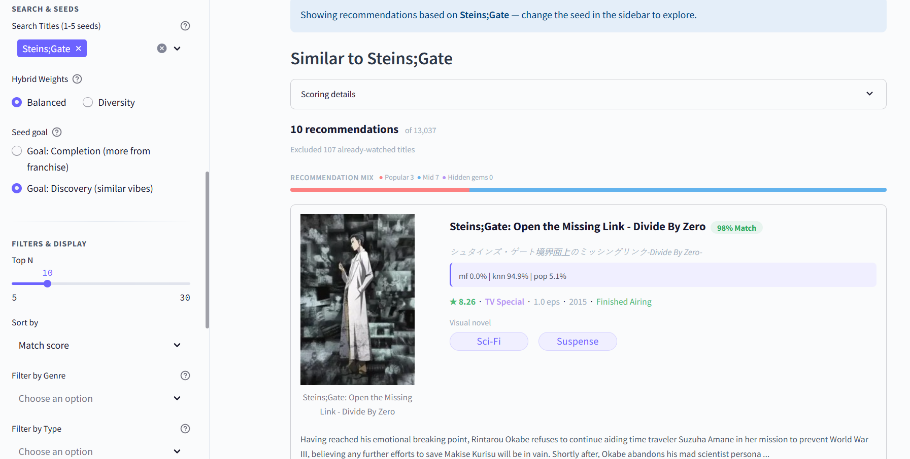
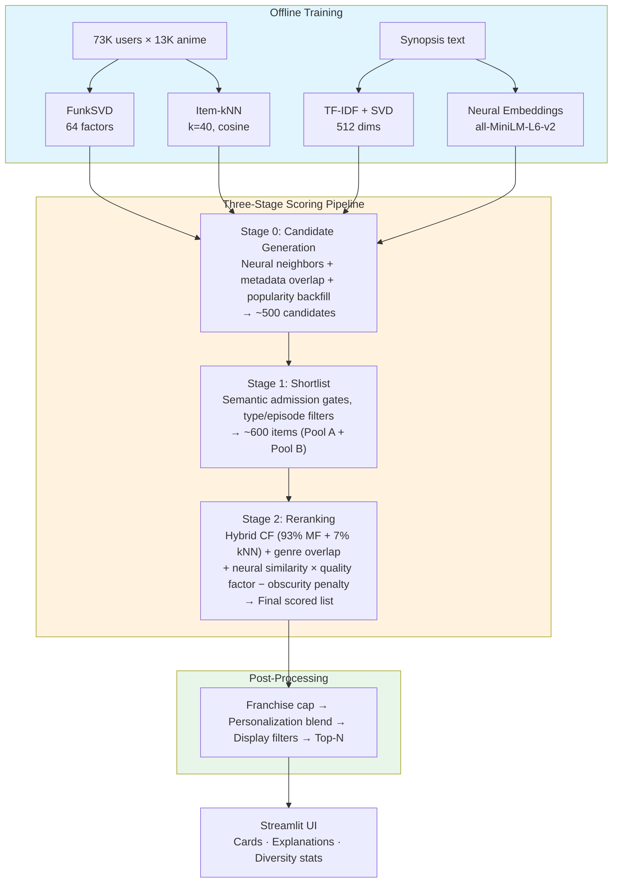

# MARS — My Anime Recommendation System


[](https://codecov.io/gh/daedwards06/MyAnimeRecommendationSystem)
[](https://myanimerecommendationsystem-x6rqm6vqjmbr2ij8i8yk3b.streamlit.app)

A **hybrid recommendation engine** that combines collaborative filtering, content-based similarity, and neural embeddings to recommend anime from a catalog of 13,000+ titles. Built with a three-stage scoring pipeline (candidate generation → shortlist → reranking), a Streamlit UI with explainable results, and 246 automated tests.

<!-- To update: run the app (streamlit run app/main.py), search for a popular title, take a screenshot, save to app/assets/demo_screenshot.png -->

*Seed-based recommendations for Steins;Gate showing match scores, signal explanations, and metadata cards.*

---

## Key Features

- **Three-stage ranking pipeline** — candidate generation (neural + metadata + popularity pools), semantic shortlisting, hybrid reranking with 10+ scoring signals
- **Hybrid collaborative filtering** — FunkSVD matrix factorization (93%) + item-kNN (7%), trained on 73K users and 310K+ ratings
- **Multi-modal content signals** — TF-IDF, SVD embeddings, and neural sentence embeddings (all-MiniLM-L6-v2) for synopsis-level semantic matching
- **Personalization** — import your MyAnimeList profile; blend seed-based and CF-based recommendations 0–100% with a slider
- **Explainability** — every recommendation shows signal breakdown (CF / Content / Popularity shares), genre overlap, and match confidence
- **Diversity controls** — franchise capping, configurable quality factor modes, coverage and Gini tracking

## Results

All evaluations rank over the **full 13K-item catalog** (no pre-filtered shortlist), seeded (`seed=42`) for reproducibility. See [`reports/phase4_evaluation.md`](reports/phase4_evaluation.md) and the [model card](docs/MODEL_CARD.md#metrics) for protocol details, cold-start analysis, and caveats.

### Ablation — lift over baseline (K=10)

The headline result: the hybrid model delivers a **+43% NDCG** and **+61% MAP** lift over a popularity-only baseline.

| Variant | NDCG@10 | MAP@10 | vs. Popularity |
|---------|---------|--------|----------------|
| **Hybrid (MF + kNN + content)** | **0.044** | **0.030** | **+43% NDCG · +61% MAP** |
| Popularity baseline | 0.031 | 0.018 | (baseline) |
| Content-only (TF-IDF) | 0.025 | 0.021 | — |

### Temporal split (heuristic robustness check)

| Metric | @5 | @10 | @20 |
|--------|-----|------|------|
| NDCG | 0.440 | 0.438 | 0.445 |
| MAP | 0.153 | 0.090 | 0.074 |

> **Caveat:** this split approximates chronological order from *synthetic* timestamps (no real interaction dates in the snapshot), so these values may be inflated by ordering artifacts. Treat them as a heuristic robustness check, not a headline accuracy claim — the ablation lift above is the more defensible comparison.

### Beyond-accuracy (@10)

| Coverage | Gini |
|----------|------|
| 0.18% | 0.50 |

Low top-10 coverage reflects real popularity concentration — a known limitation tracked in the model card.

## Architecture


```mermaid
graph TB
    subgraph Offline["Offline Training"]
        D1[73K users × 13K anime] --> M1[FunkSVD<br/>64 factors]
        D1 --> M2[Item-kNN<br/>k=40, cosine]
        D2[Synopsis text] --> M3[TF-IDF + SVD<br/>512 dims]
        D2 --> M4[Neural Embeddings<br/>all-MiniLM-L6-v2]
    end

    subgraph Pipeline["Three-Stage Scoring Pipeline"]
        S0["Stage 0: Candidate Generation<br/>Neural neighbors + metadata overlap + popularity backfill<br/>→ ~500 candidates"]
        S1["Stage 1: Shortlist<br/>Semantic admission gates, type/episode filters<br/>→ ~600 items (Pool A + Pool B)"]
        S2["Stage 2: Reranking<br/>Hybrid CF (93% MF + 7% kNN) + genre overlap<br/>+ neural similarity × quality factor − obscurity penalty<br/>→ Final scored list"]
    end

    subgraph Post["Post-Processing"]
        PP["Franchise cap → Personalization blend → Display filters → Top-N"]
    end

    M1 --> S0
    M2 --> S0
    M3 --> S0
    M4 --> S0
    S0 --> S1 --> S2 --> PP

    PP --> UI["Streamlit UI<br/>Cards · Explanations · Diversity stats"]

    style Offline fill:#e1f5ff
    style Pipeline fill:#fff3e0
    style Post fill:#e8f5e9
```

## Quick Start

```bash
git clone https://github.com/daedwards06/MyAnimeRecommendationSystem.git
cd MyAnimeRecommendationSystem
python -m venv .venv && .venv\Scripts\activate  # Windows
pip install -r requirements.txt
streamlit run app/main.py
```

The app loads with a default seed and shows recommendations immediately — no setup needed.

**Optional — Personalization:** Import your [MyAnimeList export](https://myanimelist.net/panel.php?go=export) via the sidebar to get CF-based recommendations from your own ratings. The app shows inline export instructions right next to the upload widget. See [`docs/user_guide_personalization.md`](docs/user_guide_personalization.md) for the full walkthrough.

## Updating the Anime Catalog

The catalog ships with 13,000+ titles. To add newly aired anime (e.g., a new season's premieres):

```bash
# Full refresh — discover new IDs from Jikan, fetch metadata, rebuild all artifacts:
python scripts/refresh_catalog.py

# Or target a specific season:
python scripts/refresh_catalog.py --season 2026 winter

# Makefile shortcuts:
make refresh-all
make refresh-season YEAR=2026 SEASON=winter
```

The refresh pipeline runs 7 steps automatically: discover → fetch metadata → build features → synopsis TF-IDF → synopsis embeddings → retrain CF models → enrich images. Use `--skip-models`, `--skip-synopsis`, or `--skip-images` to skip expensive steps. See [`docs/data_catalog.md`](docs/data_catalog.md) for the full data lineage.

## Project Structure

```
├── app/main.py                  # Streamlit entry point (UI lives in src/app/components/)
├── src/
│   ├── app/
│   │   ├── scoring_pipeline.py  # Pure-Python 3-stage pipeline (~2,000 lines)
│   │   ├── artifacts_loader.py  # Model loading + validation
│   │   ├── constants.py         # All scoring weights & thresholds
│   │   ├── recommender.py       # Hybrid CF blending
│   │   ├── stage0_candidates.py # Candidate generation
│   │   ├── stage1_shortlist.py  # Shortlist construction
│   │   └── components/          # Card rendering, explanations, diversity panel
│   ├── models/                  # FunkSVD, kNN, content similarity, user embeddings
│   ├── eval/                    # Metrics (NDCG, MAP, coverage, Gini, graded relevance)
│   ├── features/                # Feature engineering, embeddings, scaling
│   └── data/                    # Data loading, MAL parser, user profiles
├── scripts/
│   ├── refresh_catalog.py       # End-to-end catalog refresh (discover → retrain)
│   ├── fetch_jikan.py           # Fetch metadata from Jikan API
│   ├── discover_new_ids.py      # Find new MAL IDs missing from catalog
│   ├── build_features.py        # Feature engineering orchestrator
│   └── save_artifacts.py        # Retrain & save CF models
├── tests/                       # 246 tests across 23 files
├── reports/                     # Evaluation reports, ablation studies
├── models/                      # Trained model artifacts (.joblib, gitignored)
└── data/                        # Processed parquets + samples tracked; image & Jikan caches gitignored
```

## Tech Stack

**ML/Data:** NumPy, pandas, scikit-learn, Optuna | **Embeddings:** sentence-transformers (all-MiniLM-L6-v2, optional — offline build only) | **App:** Streamlit | **Search:** RapidFuzz | **CI:** GitHub Actions, pytest

## Documentation

| Topic | Link |
|-------|------|
| **Deployment to Streamlit Cloud** | [`docs/DEPLOYMENT.md`](docs/DEPLOYMENT.md) |
| Evaluation & ablation | [`reports/phase4_evaluation.md`](reports/phase4_evaluation.md) |
| Model card | [`docs/MODEL_CARD.md`](docs/MODEL_CARD.md) |
| Personalization guide | [`docs/user_guide_personalization.md`](docs/user_guide_personalization.md) |
| Watchlist import | [`docs/user_guide_watchlist.md`](docs/user_guide_watchlist.md) |
| Data catalog | [`docs/data_catalog.md`](docs/data_catalog.md) |
| Scoring pipeline design | [`docs/scoring_pipeline_integration_guide.md`](docs/scoring_pipeline_integration_guide.md) |
| Data sources & licensing | [`docs/DATA_SOURCES.md`](docs/DATA_SOURCES.md) |
